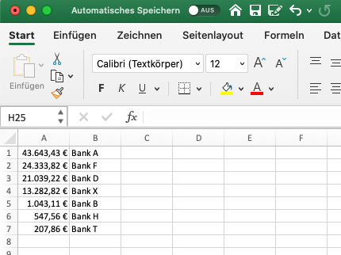

# MoneyMoney Extension: Sum by Bank

This is an AppleScript extension for the great [MoneyMoney software](https://moneymoney-app.com/) to generate an Excel list with all sums by bank account.  
This is e.g. useful to monitor certain threshold values per bank.

## Installation

For this AppleScript to work it is necessary to add a custom attribute `bankIdentifier` to each account in MoneyMoney
that you want to track. The sums are then summed up by this chosen bank identifier.

*Note: Basically a better way would be to group by account bic but not all accounts do have a bic (e.g. credit cards).* 

If you want to use the AppleScript within the services menu of the _MoneyMoney_ application, the best way is to use the [Mac Automator](https://support.apple.com/de-de/guide/automator/aut73234890a/mac): 
1. Create a new "Quick Action Workflow" in Automator 
1. Choose "No Input" in "MoneyMoney"
1. Add the action "Execute AppleScript" and paste the contents of the file `moneymoney-sum-by-bank.scpt` into the text box
1. Save the workflow

Then you have a new menu item with the chosen name in _MoneyMoney > Services_.

## Usage

After click on the new menu item in _MoneyMoney > Services_, Microsoft Excel will open and show all bank sums in a descending order:  

For more information see also [my blog post](https://knete-rechner.de/geld-wissen/moneymoney-maximum-pro-bank/).

## Notes

- The MoneyMoney application has to be unlocked when executing the script otherwise an error will be thrown

## Known Limitations
- Support only for Euro currency
- Accounts with no `bankIdentifier` attribute are ignored in export file

## License

